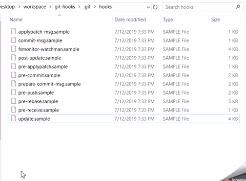

# Awesome Git Hooks 

:anchor: Easy-to-use git hooks for automating tasks during git workflows.

:heavy_check_mark: Nothing to install/download

:heavy_check_mark: Code is well-documented

:heavy_check_mark: Grab & go! Copy the code you want to use and paste into your .git/hooks folder

## Contents

- [Git Hooks Explained](#git-hooks-explained)
- [Common Situations Where Git Hooks are Useful](#common-situations-where-git-hooks-are-useful)
- [Quick Start - How to Use a Git Hook](#quick-start---how-to-use-a-git-hook)
- [Overview of Hooks](#overview-of-hooks)
- [Helpful Hints](#helpful-hints)
- [Written Guides](#written-guides)
- [Video Guides](#video-guides)

## Git Hooks Explained

Git hooks are custom scripts you can use to automate tasks which are triggered before or after a git command is executed.

> "Like many other Version Control Systems, Git has a way to fire off custom scripts when certain important actions occur. There are two groups of these hooks: client-side and server-side. Client-side hooks are triggered by operations such as committing and merging, while server-side hooks run on network operations such as receiving pushed commits. You can use these hooks for all sorts of reasons." - [git-scm.com](https://git-scm.com/book/en/v2/Customizing-Git-Git-Hooks)

## Common Situations Where Git Hooks are Useful

Do you ever push your code, only to realize you forgot to run that darn formatting command? There's a git hook for that!

Ever wonder why your code doesn't work after switching branches and realize it's because you forgot to update submodules (again)? Don't worry, there's a git hook for that too!

Do you write code using a work email at work and a school email at school using the same computer? Ever accidentally use the wrong email in your project's config? That means you won't show up correctly as the commit author. Time to _git_ hooked on git hooks!

## Quick Start - How to Use a Git Hook

1. Pick a hook, any hook! Try the "verify-name-and-email" one if you're not sure where to start.
2. Navigate to your project's hooks folder (.git/hooks).
3. You should see a list of files already in there. Create a new file called the exact commit type that you want to use (eg: "commit-msg", "pre-rebase", "update", etc.). Do not give it an extension. (So if trying out the "verify-name-and-email" hook, create a file called "pre-commit")

4. Open your new file and paste the code from the hook you chose out of this repo. (eg: [verify-name-and-email.hook](https://github.com/CompSciLauren/git-hooks/blob/master/pre-commit-hooks/verify-name-and-email.hook))
5. Save file. Done! Now the git hook will be triggered by whatever event should cause it. (So with "verify-name-and-email", if you try to make a commit when your user.name or user.email in your git config doesn't match the name or email you specified in the git hook, it will fail the commit)

## Overview of Hooks

Each git hook is a sequence of commands to be executed at some point either before or after a git command is executed. All hooks in this repo are organized based on when a person would most likely need them to be executed. Follow the steps above to get started using a git hook. For a list of git commands that can trigger a git hook, visit [git-scm.com/docs/githooks](https://git-scm.com/docs/githooks).

This repo contains the following hooks:

### commit-msg hooks

invoked by `git commit` and `git merge`

- [enforce-insert-issue-number](https://github.com/CompSciLauren/awesome-git-hooks/blob/master/commit-msg-hooks/enforce-insert-issue-number.hook) - Make sure user did not delete the ISSUE-\[#] string that was generated by prepare-commit-msg/insert-issue-number.hook.

### post-checkout hooks

invoked by `git checkout`

- [delete-pyc-files](https://github.com/CompSciLauren/awesome-git-hooks/blob/master/post-checkout-hooks/delete-pyc-files.hook) - Delete all .pyc files every time a new branch is checked out.
- [new-branch-alert](https://github.com/CompSciLauren/awesome-git-hooks/blob/master/post-checkout-hooks/new-branch-alert.hook) - Display a message when a new branch is checked out for the first time.

### post-update hooks

invoked by git-receive-pack on the remote repository, which happens when a git push is done on a local repository

- [update-server-info](https://github.com/CompSciLauren/awesome-git-hooks/blob/master/post-update-hooks/update-server-info.hook) - Prepare a packed repository for use over dumb transports (e.g. http).

### pre-commit hooks

invoked by `git commit`

- [format-code](https://github.com/CompSciLauren/awesome-git-hooks/blob/master/pre-commit-hooks/format-code.hook) - Run command to format code and re-add any files modified after formatting.
- [search-term](https://github.com/CompSciLauren/awesome-git-hooks/blob/master/pre-commit-hooks/search-term.hook) - Fail commit if a specific term is found in the code.
- [spell-check-md-files](https://github.com/CompSciLauren/awesome-git-hooks/blob/master/pre-commit-hooks/spell-check-md-files.hook) - Check files with .md extension for spelling errors.
- [verify-name-and-email](https://github.com/CompSciLauren/awesome-git-hooks/blob/master/pre-commit-hooks/verify-name-and-email.hook) - Fail commit if user.name or user.email is incorrect.

### prepare-commit-msg hooks

invoked by `git commit`

- [include-git-diff-name-status](https://github.com/CompSciLauren/awesome-git-hooks/blob/master/prepare-commit-msg-hooks/include-git-diff-name-status.hook) - Include the output of "git diff --name-status -r" into the message, just before the "git status" output.
- [insert-issue-number](https://github.com/CompSciLauren/awesome-git-hooks/blob/master/prepare-commit-msg-hooks/insert-issue-number.hook) - Insert issue number to beginning of the commit message.

### pre-push hooks

invoked by `git push`

- [prevent-bad-push](https://github.com/CompSciLauren/awesome-git-hooks/blob/master/pre-push-hooks/prevent-bad-push.hook) - Prevent push of commits where the log message starts with "WIP" (work in progress).

### pre-rebase hooks

invoked by `git rebase`

- [prevent-rebase](https://github.com/CompSciLauren/awesome-git-hooks/blob/master/pre-rebase-hooks/prevent-rebase.hook) - Prevent topic branches that are already merged to 'next' branch from getting rebased, because allowing it would result in rebasing already published history.

### query-watchman hooks

not invoked by a specific git command

- [fsmonitor-watchman](https://github.com/CompSciLauren/awesome-git-hooks/blob/master/query-watchman-hooks/fsmonitor-watchman.hook) - Output to stdout all files that have been modified since a given time.

### update hooks

invoked by "git receive-pack" with arguments: refname sha1-old sha1-new

- [update](https://github.com/CompSciLauren/awesome-git-hooks/blob/master/update-hooks/prevent-unannotated-tags.hook) - Block unannotated tags from entering.

## Helpful Hints

You can bypass pre-commit or commit-msg hooks by adding `--no-verify` to the end of either command

If hooks fail to execute, make sure your hook files are executable (chmod +x)

## Written Guides

- [Git hooks documentation at git-scm.com](https://git-scm.com/docs/githooks)

- [Git Pro book by Scott Chacon and Ben Straub](https://git-scm.com/book/en/v2)

- [An Introduction to Git Hooks](https://www.sitepoint.com/introduction-git-hooks/)

- [Atlassian Tutorial on Git Hooks](https://www.atlassian.com/ru/git/tutorials/git-hooks)

- [Easy git hooks with husky](https://www.vojtechruzicka.com/githooks-husky/)

- [Git Hooked](https://www.javascriptjanuary.com/blog/git-hooked 'Git Hooked')

- [How To Use Git Hooks To Automate Development and Deployment Tasks](https://www.digitalocean.com/community/tutorials/how-to-use-git-hooks-to-automate-development-and-deployment-tasks)

- [Automate Your Workflow with Git Hooks](https://hackernoon.com/automate-your-workflow-with-git-hooks-fef5d9b2a58c)

- [Using JavaScript in Your Git Hooks](https://medium.com/@Sergeon/using-javascript-in-your-git-hooks-f0ce09477334 'Using JavaScript in Your Git Hooks')

- [An In-Depth Look at Git Hooks](https://dzone.com/articles/an-in-depth-look-at-git-hooks)

- [Git hooks and practical uses. Yes, even on Windows.](https://www.tygertec.com/git-hooks-practical-uses-windows/)

## Video Guides

- [Git Hooks Part 1 - Getting Started](https://www.youtube.com/watch?v=aB3eq52sZSU)

- [Git hooks and practical uses. Yes, even on Windows.](http://www.youtube.com/watch?feature=player_embedded&v=fMYv6-SZsSo&t=240s)

## License

 This work is licensed under a <a rel="license" href="http://creativecommons.org/licenses/by/4.0/">Creative Commons Attribution 4.0 International License</a>.
